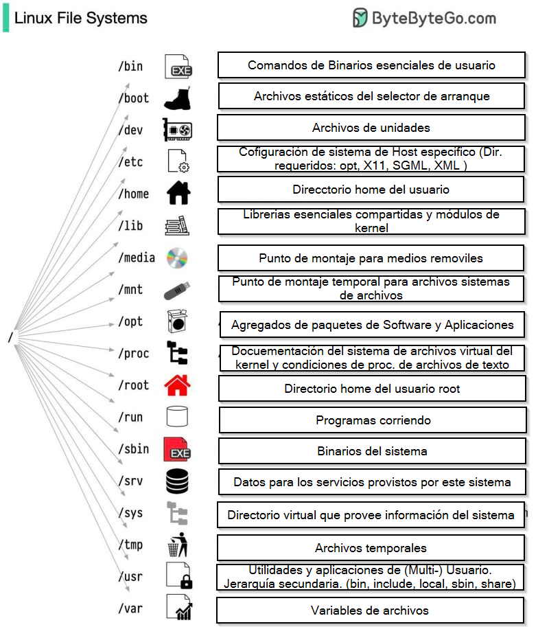

# Conceptos!
## Linux
La estructura de los directorios de Linux, así como su contenido y funciones, viene definida en el denominado Filesystem Hierarchy Standard o FHS por sus siglas en inglés, esté el estándar de jerarquía para los sistemas de archivos en sistemas Linux y otros derivados de UNIX como FreeBSD.

