# Ejercicio práctico
1) Crear un subdirectorio llamado maestria5 en el directorio de trabajo (home/Kali)
    *  Visualizamos con el comando [pwd] que estemos en el directorio kali, en este caso es: (/home/deed)
    
    * Creamos con el comando mkdir el directorio maestria5
    
    *	Verificamos con el comando ll el directorio creado
    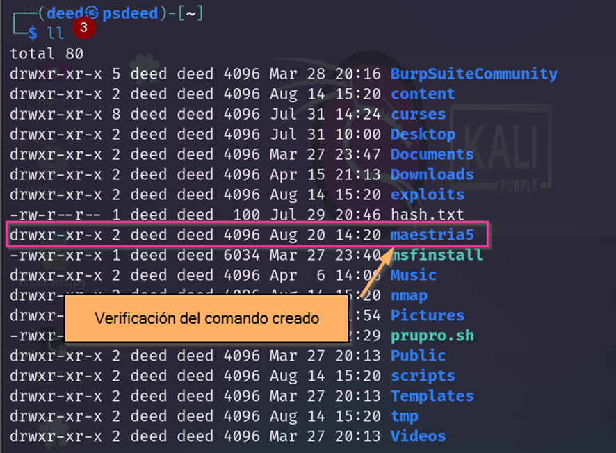
2) Ir al directorio creado maestria5
    * Con el comando cd ingresamos al directorio mestria5 y verificamos con el comando pwd.
    
3) Cree en el directorio maestria5 tres subdirectorios llamados clase.uno, clase.2 y clase_3.
    * Con el comando mkdir y separado con un espacio creamos los tres directorios y listamos con el comando ll para verificar.
    
4)	Borrar el directorio clase_3
    *	Con el comando rmdir, se elimina el directorio mencionado
    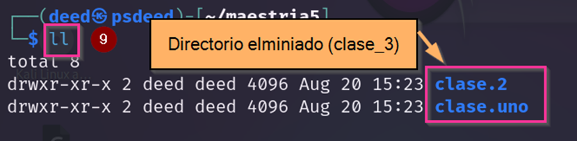
5)	Comprobar la eliminación del directorio clase_3
    *	Con el comando ll se lista el contenido y se visualiza solo dos direcctorios
    
     
6)	Ir a la clase.uno y crear un archivo de texto con el editor nano.
    *	Ingresamos con el comando cd al directorio clase.uno.
    *	Con el comando nano se crea un archivo de texto llamado file.txt.
    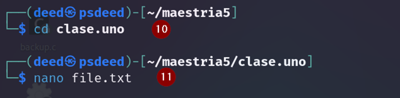
    *	Se despliega una nueva terminal e ingresamos algún ejemplo
    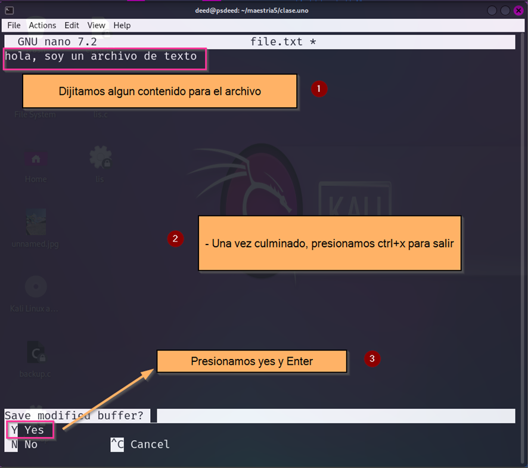
    * Con el comando ll verificamos la creación del archivo y con el comando cat, visualizamos el contenido del arvhivo creado
    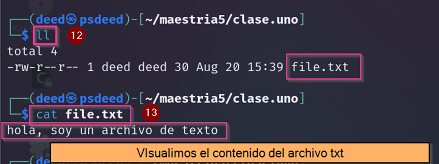
 
7)	Ir al directorio clase2 y crear dos archivos de texto por medio de vi, de nombre prueba1.txt y prueba2.doc
    *	Regresamos al directorio anterior con el comando cd ..
    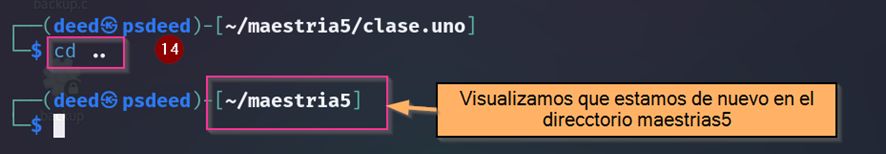
    *  	Con el comando cd ingresamos al directorio clase2
    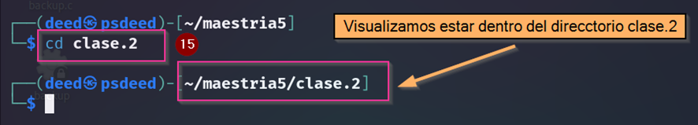
    *	Con el comando vi creamos dos archivos con extensión txt y doc. Empezamos con extensión txt
    
    *	Se despliega la terminal de vi, tecleamos la letra i para poder ingresar texto.
    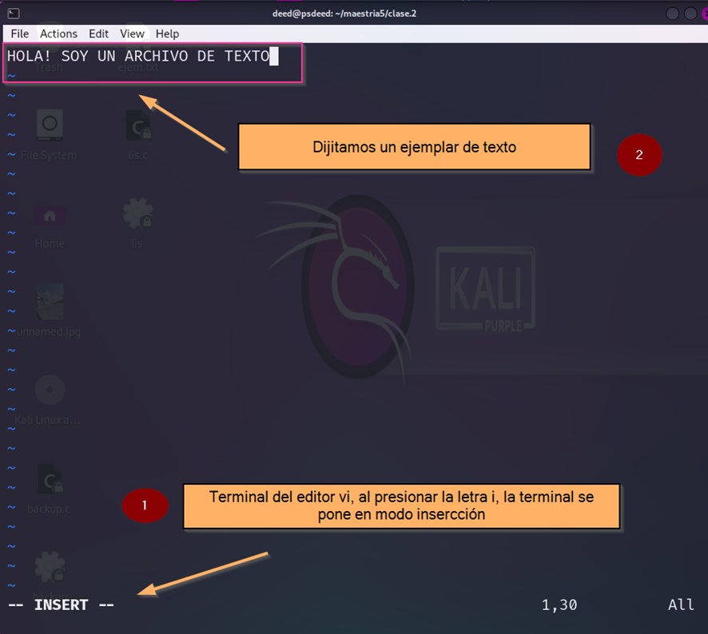
    *	Presionamos Esc para salir del modo inserción
    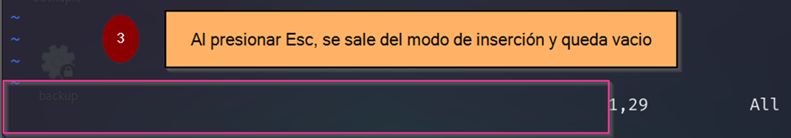
    *	Ingresamos el siguiente comando :x para salir y guardar el archivo
    
    *	Con cat visualizamos el contenido
    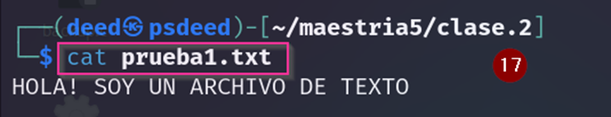
    *	Con el comando vi creamos dos archivos con extensión txt y doc. Empezamos con extensión doc
    
    *	Se despliega la terminal de vi, tecleamos la letra i para poder ingresar texto.
    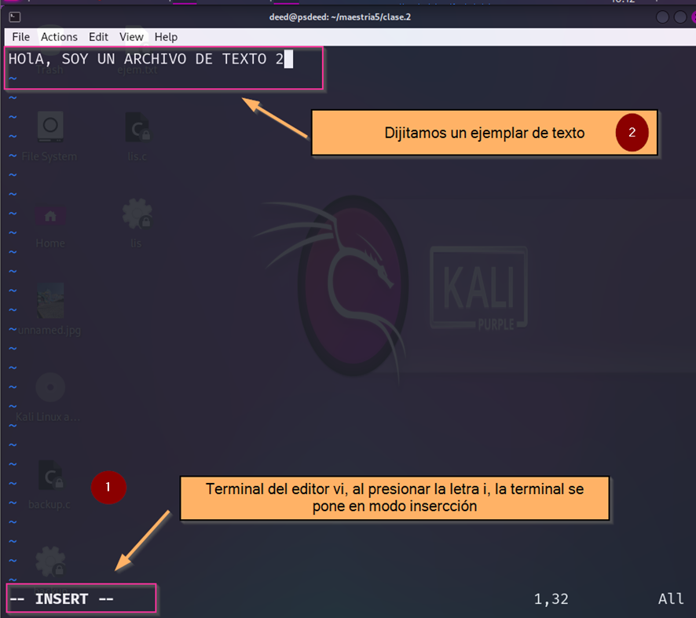
    *	Presionamos Esc para salir del modo inserción
    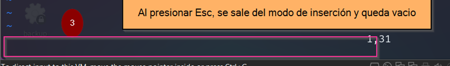
    *	Ingresamos el siguiente comando para salir y guardar el archivo
    
    *	Con cat visualizamos el contenido
    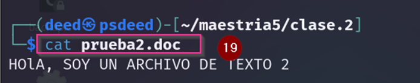
    - **Nota:** El editor vi, solo usa ingreso mediante teclado, no se puede usar el mouse.
8)	Sin salir de la carpeta clase2, copiar el archivo que está en clase.uno hacia el directorio de clase2 con el nombre arvhivo1.copia
    *	Con el comando cp realizamos la copia y para detectar que la copia se haga en el directorio actual, ingresamos el punto (.). 
    
    *	Listamos con el comando ll para verificar la copia
    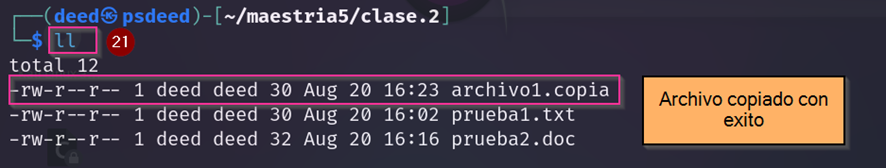
    *	Realizamos una comparación del contenido copiado con el comando cat
    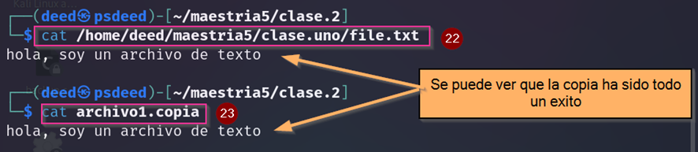
9)	En el directorio clase.uno crear un archivo llamado lista.txt que contenga la cantidad de elementos del direccotorio /etc y del directorio /var/log
    *	Para enviar el contenido del directorio /etc, usaremos el comando echo para imprimir un msj por pantalla, ls para listar y el signo de mayor que para enviar todo el contenido al nuevo archivo llamado lista.txt y verificamos con el comando cat
    
    *	 Para enviar el contenido del directorio /var/log, usaremos el comando ls para listar y doble signo de mayor que para enviar todo el contenido al nuevo archivo llamado lista.txt, evitando la sobreescritura.
    
    *	Con el comando cat verificamos
    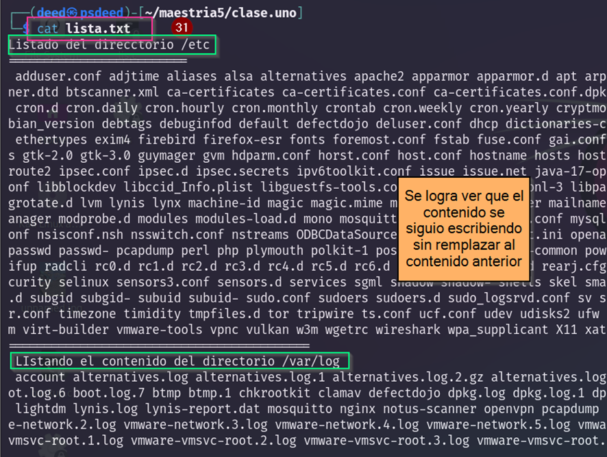
10)	Listar los 10 archivos de mayor tamaño que existen en el direccotrio /var/log y en el directorio /etc
    *	En este caso usaremos los siguientes comandos. du para listar, sort para ordendar, tail para imprimir solo los 10 primeros y nl para listar el número de líneas, que son 10.
    *	Listando el contenido del direcotrio /var/log
    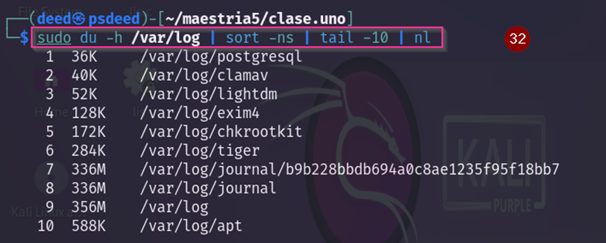
    *	Listando el contenido del directorio /etc
    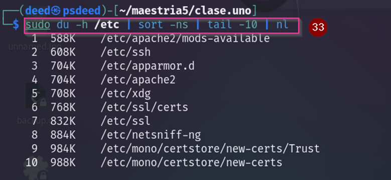
 
