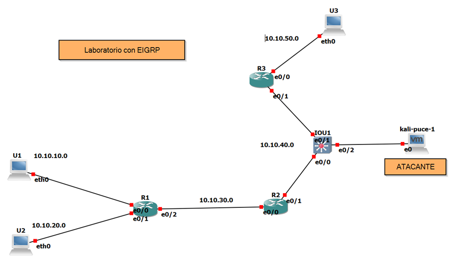
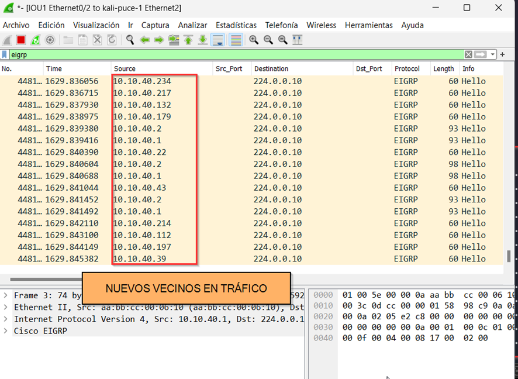
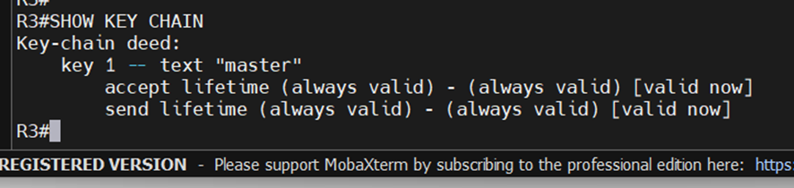

# Ataque EIGRP e implementación de seguridad en protocolo.
## A continuación, se realiza levantamiento de laboratorio para trabajar en entornos controlados.

### Comandos usados para levantar el laboratorio
    R1
   

    R2
   

    R3
   

    Ubuntu 1
   

    Ubuntu 2
   

    Ubuntu 3
   

    Kali
   

Visualizamos la ip creada

---
### Reconocimiento
Ahora con visualizamos las tablas vecino en los routers.
    #R1
   

    #R2
   

    #R3
   

Con wireshark verificamos el tráfico de de R1 y R2, se logrará visualizar las direcciones multicast que es enviada cada 5 segundos con msj hello
   

Realizamos una prueba de ping del Ubuntu 1 al Ubuntu 3
    

Ya configurado un Laboratorio sin medidas de mitigación, vamos a realizar vencindades falsas al Router 3. Misma que tiene un solo vecino.

Visualizamos el tráfico del atacante hacia R1 Y R2, visualizaremos el tráfico de msj hello y veremos la dirección multicast generada en los routers pero aún no hay msj del atacante.

   

---
### Envenamiento
En la imagen anterior no está la ip del atacante porque lo único legal es el tráfico de msjs hello entre Routers.
Con una herramienta llamada EIGRPWN, vamos hacer creer al router 2 y 3 que el atacante también es un vecino más.

   

Lanzamos el ataque con helloflooding.py

---
### Reconociendo el ataque
En imagenes anteriores visualizamos solo un vecino pero ahora ya se logra ver una inundación de msjs hello
En wireshark se visualiza la inundación de los dos Routers como la inundación creada por el atacante, en la imagen anterior se visualiza que no tenemos dicha inundación.

    #R2

    #R3

    En la máquina del atacante se lográ ver la cantidad de paquetes enviados
   
   
---
### Mitigación
#### Implementación de autenticación en el protocolo EIGRP
Para poder solucionar esta problemática, necesitamos implementar en los routers autenticación en los protocolos mediante encriptación ya que en texto plano es inseguro.

    #R2
    Creamos una llave única q se guardará en la memoria del router esperando a ser pedida.

   

    Ahora le asignamos a la interface que estará lista para dar su clave única al otro otro router que contenga la misma clave cifrada

 

    #R3
    Lo mismo se realiza en el router contrario

Esta implementación es fundamental para proteger la red contra amenazas como ataques de denegación de servicio distribuido (DDoS), secuestros de prefijos y fugas de rutas involuntarias. Además, la seguridad de enrutamiento puede ayudar a proteger a otros usuarios de Internet al evitar que las amenazas se propaguen a través de una red.

La implementación de esta mitigación contiene autenticación y la encriptación de contraseñas y el control de acceso entre routers. Estas medidas pueden ayudar a garantizar que solo se acepten y se anuncien las rutas legítimas, protegiendo así la integridad y la confidencialidad de la red.

#### Verificación de clave cifrada creada
    #R2

    #R3

---
### Envenamiento al protocolo EIGRP con autenticación cifrada
Visualizamos los msjs hello con wireshark

En la máquina del atacante procedemos a realizar el ataque nuevamente

Ahora visualizamos en la tabla de vecinos en los reouters y veremos que no se agregaron más vecindades ya que esta con claves de autenticación.

E igual observamos el el router 3 que solo tiene registrada para una vencidad

En la máquina Kali se lanzo un total de 515317 packetes

