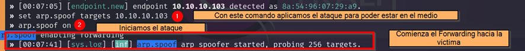

# Ataque Man-in-the-Middle con bettercap
## Conceptos aplicados

* **Ataque MiTM:** Un ataque Man-in-the-Middle es cuando un atacante se sitúa entre la comunicación de dos partes y puede interceptar o modificar la información que se transmite.
* **Bettercap:** Bettercap es una herramienta de pentesting utilizada para realizar ataques MiTM y otras pruebas de seguridad en redes. Facilita la captura y manipulación del tráfico de red.
* **ARP Spoofing:** es una técnica utilizada en ataques MiTM donde un atacante falsifica las tablas ARP de una red para redirigir el tráfico a través de su sistema.
* **Sniffing de red:** Es el acto de interceptar y registrar el tráfico de red, lo que puede permitir a un atacante acceder a información confidencial.
* **Seguridad de la red:** La seguridad de la red implica implementar medidas para proteger la integridad, la confidencialidad y la disponibilidad de los datos y recursos de una red.

---
### Laboratorio Levantado
   
        Visualizamo la tabla Arp de la Victima

   
        Aún no se visualiza remplazo de la MAC.

---
#### Recocimiento

    Como los switch no tienen un medida de protección, simularemos que estamos en un centro TICS, En los servidores y nos conectamos a un puerto del switch para realizar un reconocimiento de equipos conectados, mediante la herramienta de bettercap.
   

---
#### Envenamiento

    Una vez localizado los hosts, tomaremos como victima a la IP 10.10.10.103 para ver todo su tráfico que realiza durante su día de trabajo.
   

    Ahora verificamos en en la tabla arp del host 10.10.10.103 y se visualizara que la Mac se duplico y ahora el trafico se irá hacia el atacante.
   

    El usuario esta ingresando a su página web de trabajo **http://testphp.vulnweb.com/login.php**
   
---
#### Registros

    El atanque usa la herramienta de Bettercap para ver su tráfico
   
    
    El usuario ingresa sus credenciales a la página de trabajo y tiene acceso éxitoso, sin nigún problema
   
    
    Ahora el la máquina del atacante de puede capturar su tráfico y obtuvo las credenciales con la herramienta bettercap
   
