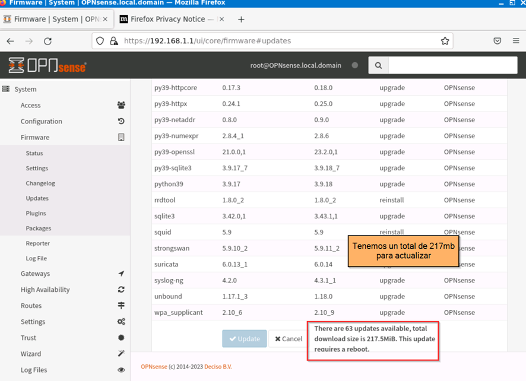
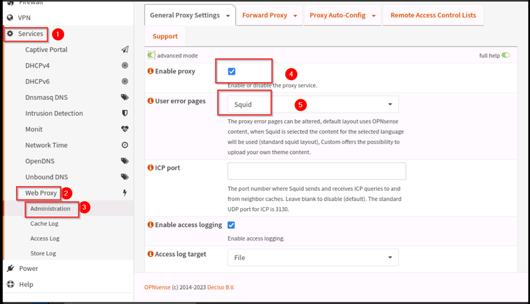
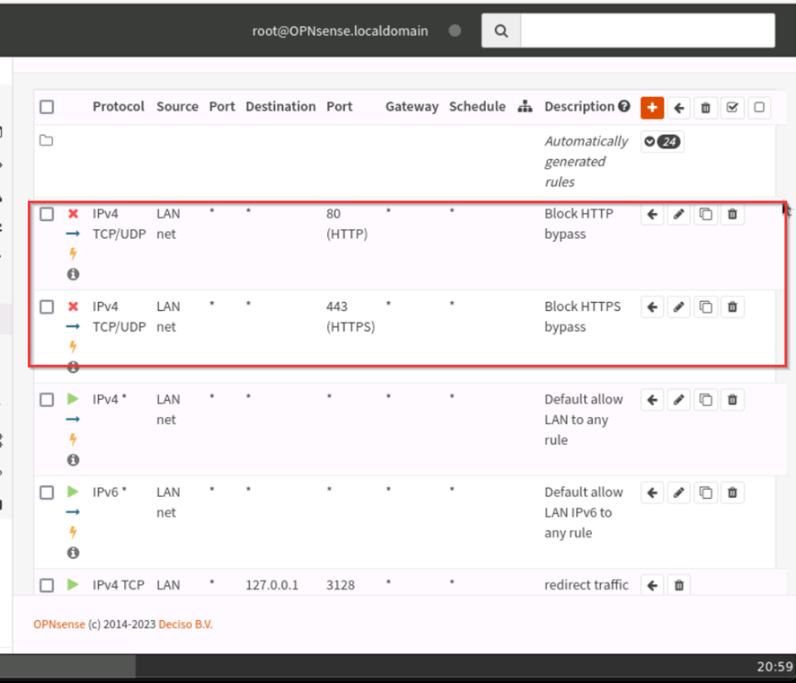

# Ejercio con OPNSense
## Filtrado Web con OPNSense.
* Implementar un proxy transparente usando SQUID y SQUIDGUARD en la plataforma OPNSENSE que permita realizar control de acceso web a los usuarios de una red LAN.
* Monitorización constante: Establecer un sistema de monitoreo de tráfico de red para detectar patrones de tráfico anormales o inusuales que puedan indicar un posible ataque EIGRP. Esto permite una respuesta rápida en caso de un incidente.
* Segmentación de red: Dividir la red en segmentos lógicos o VLANs y aplicar controles de acceso adecuados para limitar la propagación de paquetes EIGRP maliciosos. La segmentación ayuda a evitar que un ataque se propague por toda la red.
* Actualización de firmware y parches: Mantener el firmware y el software de enrutadores y dispositivos de red actualizados con las últimas actualizaciones y parches de seguridad. Los ataques a menudo se aprovechan de vulnerabilidades conocidas, por lo que mantener actualizado a un sistema es crucial

## Conceptos básicos
* El paquete Squid en OPNsense es un servidor proxy transparente que se utiliza para mejorar el rendimiento y la seguridad de la red. Algunas de las funciones y características clave de Squid en OPNsense incluyen:
    * **Caché de reenvío:** Squid puede almacenar en caché y reutilizar páginas web frecuentemente solicitadas, lo que reduce el ancho de banda y mejora los tiempos de respuesta.
    * **Control de acceso:** Squid puede utilizarse para autenticar a los usuarios y aplicar listas de control de acceso (ACL) para filtrar el tráfico web basado en categorías o reglas personalizadas.
    * **Proxy transparente:** Squid puede configurarse como un proxy transparente, lo que significa que los clientes no necesitan realizar ninguna configuración especial para utilizarlo. El tráfico web se enruta automáticamente a través del proxy sin que los usuarios sean conscientes de ello.
    * **Filtrado de contenido:** Squid puede utilizarse junto con SquidGuard para aplicar políticas de filtrado de contenido y bloquear el acceso a sitios web no deseados o peligrosos.
    * **Registros y estadísticas:** Squid registra información detallada sobre el tráfico web, lo que permite generar informes y estadísticas para analizar el uso de la red.
    
### A continuación, se realiza levantamiento de laboratorio para trabajar en entornos controlados.

Ingresamos a la interfaz gráfica de OPNSense para sus respectivas configuraciones

   

Una vez configurado todo, se nos desplegará la siguiente pantalla que nos Ayudará a visualizar la exitosa instalación y de paso actualizamos al sistema

Procedemos actualizar

Actualizado a la última versión

OPNSense ya viene habilitado para que los clientes tengan acceso a internet

Ya instalado el OPNSense implementamos un proxy transparente usando SQUID y SQUIDGUARD en la plataforma OPNSENSE que permita realizar control de acceso web a los usuarios de una red LAN. 

---
### Filtrado Web

Para una mejor guía, siempre es bueno basarnos en la documentación oficial de OPNSense: [¡Da click para ir a la página oficial!](https://docs.opnsense.org/manual/how-tos/proxytransparent.html "Información Adicional")

Para que todo funcione, hay que verificar el certificado SSL que es esencial para garantizar la seguridad y la privacidad de las comunicaciones en línea. Ayuda a prevenir el robo de información y protege a los usuarios contra posibles ataques cibernéticos. En caso de que no este creado, se procedería a crearlo.

Esta certificación se tiene que descargar e instalarla en los equipos host pero en nuestro caso omitiremos dicha instalación
Verificamos que aún no está instalado el squid

--- 
### Instalación de SQUID
Nos vamos a la configuración general del proxy y habilitamos con el respectivo squid

También hay que habilitar lo siguiente

Una vez configurado no redirigimos Al local cache

Agregamos una nueva regla pero dejaremos por default todo

Ahora ya tenemos una nueva regla creada y daremos click en guardar cambios

Ahora nos regresamos al forward proxy y habilitamos

Para verificar el servicio del squid, vamos al Dashboard

---
#### Control de acceso web
Como prueba tendremos denegado el acceso a whatsweb, facebbok, Instagram y Telegram.

Ahora lo único que hay que hacer es agregar un alista de control de acceso.

Dijitamos las páginas de denegar en la lista negra de páginas

---
#### Pruebas en clientes
La desventaja de esto esque con squid hay que configurar el proxy en cada cliente para aplicar el filtrado web.

Toda página registrada deniega el tráfico y como youtube no se listo, se puede tener acceso sin restrincción.

**La ventaja de OPNSense esque viene incorporado un sistema de logs, en donde podremos ver todo el registro generado por parte de clientes.**

En este laboratorio se introdujeron dos clientes para prueba con ip 192.168.1.101 y 102

En OPNSense se visualiza el historial de cada uno de los clientes.

Como se puede ver, para filtrar la web hay que dijitar manualmente cada dirección web y es algo tedioso. Para mejorar este filtrado tenemos el squidguard. Que contiene un listado de muchas páginas y es más fácil su administración y control.

---
### Instalación de SQUIDGUARD
En esta ocasión crearemos un certificado de autoridad para ser descargado en la máquina host para que valide y no estar que digitando en los navegadores la ip y el puerto del proxy.

Creamos el certificado

Una vez creado el certificado procedemos a descargarlo en el host

Instalamos el certificado en entidades de certificación de confianza

Habilitamos la opción de OPNSense y aplicamos los cambios

Habilitamos proxy transparente  para http y http y salgan por los puertos 3128-3129

Y escogemos la certificación creada anteriormente

Verificamos las reglas creadas

Descargamos el squirdguard y aplicamos cambios

Nos dirijimos al firewall a crear las reglas para http y https

Lo mismo para el puerto 443

Ahora movemos las reglas a primer lugar para que sea lo primero que deban respetar los hosts.

#### Ahora solo probamos en el cliente la navegación.

En Disney tenemos acceso, pero redes sociales y bitcoins están bloqueadas, tal y como descargamos el squidguard

