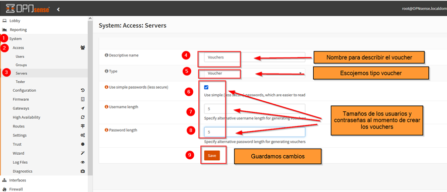
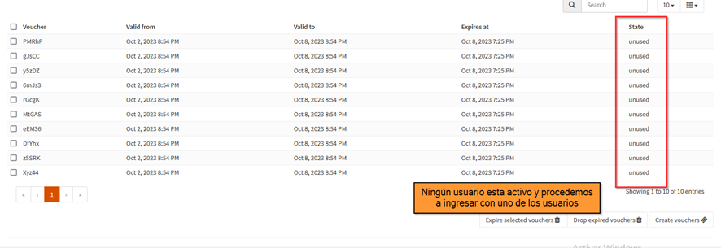

# PORTAL CAUTIVO PARA EL CONTROL DE ACCESO DE LOS USUARIOS DE LA RED LAN HACIA INTERNET UTILIZANDO LA PLATAFORMA OPNSENSE
## Implementación de Portal Cautivo con OPNSense
* **Implementar Portal Cautivo:** Configurar y desplegar con éxito un Portal Cautivo en OPNsense para controlar el acceso de usuarios de la red LAN a Internet.
* **Utilización de Zonas:** Configurar y entender el uso de zonas en OPNsense para segmentar la red y aplicar políticas de acceso de forma efectiva.
* **Generación y gestión de Vouchers:** Aprender a generar y gestionar vouchers para el acceso a Internet, proporcionando una forma segura y controlada de proporcionar acceso a los usuarios.
Configuración de plantillas (Templates): Implementar plantillas para simplificar y estandarizar la configuración del Portal Cautivo y mejorar la eficiencia de la administración.

## Descriptición de la Práctica
En esta práctica, implemente un Portal Cautivo con OPNsense para controlar el acceso de los usuarios de la red LAN a Internet. Utilice zonas para segmentar la red en grupos lógicos y aplicar políticas de acceso específicas. Además, generamos vouchers para proporcionar acceso a Internet de manera controlada y eficiente, y configuramos plantillas para simplificar la administración.

El Portal Cautivo es una solución que requiere autenticación antes de permitir el acceso a la red. Esto se logra a través de la presentación de una página de inicio de sesión cuando los usuarios intentan acceder a Internet. Los vouchers son códigos pregenerados que los usuarios pueden utilizar para obtener acceso, y las plantillas permiten una administración más eficiente al aplicar configuraciones predefinidas a múltiples zonas o interfaces.

---
## A continuación, se realiza levantamiento de laboratorio para trabajar en entornos controlados.

### Configuración Portal Cautivo
#### Configuración WAN Y LAN
Ingresamos a OPNSense para desahabilitar el bloqueo del las redes privadas y aplicamos los cambios

Las reglas para la WAN deben estar de la siguiente manera.

Ingresamos los DNS para el OPNSense

#### CONFIGURANDO 5 REGLAS EN LA LAN
* **Primera regla.-** Permitimos que los invitados accedan al reenviador de DNS.  Y el resto quedará por default

    |Action	|Pass	|Permite el tráfico|
    |-------|-------|------------------|
    |Interface	|LAN	|Interface|
    |Protocol	|TCP/UDP	||
    |Source	|LAN Net	||
    |Destination	|LAN Address||
    |Destination por range	|DNS/DNS	|Del DNS al DNS|
    |Category	|LAN Basic Rules|	Categoría utilizada para reglas de agrupación|
    |Description|	Allow DNS|	Descripción de la regla|

    * **Segunda Regla.–** Permitir el acceso por portal Cautivo
    
    |Action	|Pass|	Permite el tráfico|
    |---------|-------|----------|
    |Interface|	LAN	|Interface|
    |Protocol|	TCP	||
    |Source	|LAN Net|	|
    |Destination|	LAN Address||	
    |Destination por range|	8000/10000|	Utilizado para las zonas C.P|
    |Category	|LAN Basic Rules	|Categoría utilizada para reglas de agrupación|
    |Description	|Permitir inicio de sesión en portal cautivo	|Descripción de la regla|
    * **Tercera regla.–** Bloqueamos redes locales

    |Action	|Pass|	Permite el tráfico|
    |---------|-------|----------|
    |Interface|	LAN	|Interface|
    |Protocol|	any	||
    |Source	|LAN Net|	|
    |Destination|	LAN Net||	
    |Category	|LAN Basic Rules	|Categoría utilizada para reglas de agrupación|
    |Description	|Bloqueo de red local	|Descripción de la regla|

    Hay que tener en cuenta que estas reglas se utilizan para bloquear el acceso a nuestra red LAN local y el acceso al firewall de los Invitados. Si se tiene varias redes locales, hay que bloquear cada una de ellas con varias reglas o utilizar una subred más grande para cubrirlas todas.

    * **Cuarta Regla**

    
    |Action	|Pass|	Permite el tráfico|
    |---------|-------|----------|
    |Interface|	LAN	|Interface|
    |Protocol|	any	||
    |Source	|LAN Net|	|
    |Destination|	LAN Address||	
    |Category	|LAN Basic Rules	|Categoría utilizada para reglas de agrupación|
    |Description	|Bloqueo de Firewall	|Descripción de la regla|

    * **Quitan regla.–** Permitimos las redes de invitados

    |Action	|Pass|	Permite el tráfico|
    |---------|-------|----------|
    |Interface|	LAN	|Interface|
    |Protocol|	any	||
    |Source	|LAN Net|	|
    |Destination|	any||	
    |Destination por range|	any||
    |Category	|LAN Basic Rules	|Categoría utilizada para reglas de agrupación|
    |Description	|Permitir red invitado|Descripción de la regla|

La aplicación de las reglas debe tener este orden

---
#### CREANDO EL PORTAL CAUTIVO

Cuando se utilizan varias interfaces con el portal cautivo, cada interfaz puede tener su propia zona o varias interfaces pueden compartir una zona.

Creamos la plantilla a usar para el login del portal cautivo, en este caso vamos a descargar una plantilla de git-hub para un mejor ambiente. [¡Click para descargar plantilla!](ttps://github.com/t4skforce/OPNsense-Captive-Portal "Descarga")

Ingrese un Nombre de plantilla; para este ejemplo usamos Default. Y cargamos la platilla.

Nos dirijimos a Zonas para crear una nueva zona de la Lan para tener un acceso controlado.

 Para la configuración empresarial comenzaremos con las siguientes configuraciones:

|Enabled	|checked|	Marcamos|
|--------|------|----------|
|Interfaces||		Se agrega la interface LAN y se quita el default|
|Authenticate using	|En blanco	|Se quita la configuración predeterminada|
|Idle timeout|	0	|Descativamos el tiempo de inactividad|
|Hard timeout|	0	|Sin tiempo de espera|
|Concurrent user logins|	desmarcamos	|Solo indica que un usuario haría inicio de sesión|
|SSL certificate	|En blanco	|Se usa el http simple|
|Hostname|	En blanco	|Se utiliza para redirigir la pág. de inicio de sesión|
|Allowed addresses	|En blanco|	|
|Custom template	|default|	Seleccionamos la plantilla creada anteriormente|
|Description|	WIFIZ	|Describimos un nombre para la zona|

---
### Prueba de clientes
Ahora ingresamos un web terminal para comprobar el acceso por portal cautivo

Visualizamos la interfaz aplicada en el portal cautivo.

Ahora nos vamos a las sesiones del portal cautivo para ver el registro del usuario

#### VOUCHERS
Ahora agregamos un servidor de cupones

Ahora vamos a editar la zona para hacer uso del voucher. Ya que no usaremos al usuario root y se generará nuevos usuarios para el acceso

Creamos 10 vouchers que serán nuestros nuevos usuarios y contraseñas para poder acceder por portal cautivo.

Se descarga el contenido y visualizamos el contenido de los vouchers creados

Ahora viusalizamos en la interfaz del OPNSense la creación de los usuarios que están inactivos por el momento.

Ingresamos a un webterminal para comprobar el acceso, antes de eso, eliminamos el usuario que se ingresó anteriormente. 
Intentamos navegar en youtube pero no nos permite mientras no ingresemos un usuario.

Ingresamos usuario y contraseña

El mismo navegador nos informa que estamos mediante un portal cautivo

Ya ingresado podemos navegar tranquilamente en youtube.

Ahora tendremos un mejor control de cada host con su respectiva IP.

Ahora visualizamos en los vouchers creados que estarán activos.

## Una breve conclusión
##### Al implementar el portal cautivo se logró concluir lo siguiente:
* **Control de acceso efectivo:** La implementación del Portal Cautivo en OPNsense permitió un control de acceso efectivo a la red, lo que garantizó que solo los usuarios autorizados pudieran acceder a Internet.
* **Segmentación de la red:** El uso de zonas en OPNsense facilitó la segmentación de la red, lo que permitió aplicar políticas de acceso específicas a grupos de usuarios o dispositivos.
* **Gestión de usuarios simplificada:** La generación y gestión de vouchers resultó ser una forma eficaz y sencilla de proporcionar acceso a Internet a los usuarios, eliminando la necesidad de autenticación manual.
* **Eficiencia en la administración:**La configuración de plantillas (Templates) simplificó la administración y configuración del Portal Cautivo, lo que facilitó las actualizaciones y cambios necesarios.
* **Mejora en la seguridad:** La implementación del Portal Cautivo en OPNsense ayudó a mejorar la seguridad de la red al garantizar un acceso controlado y autorizado a Internet

