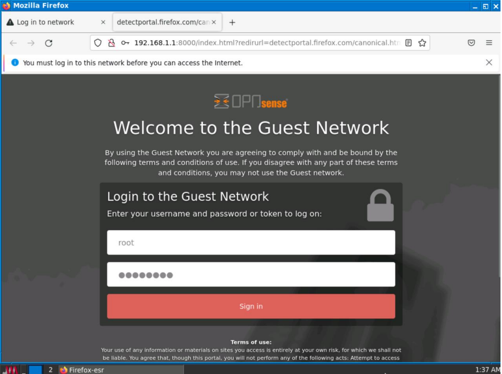

## Contenido
Comprender conceptos básicos y avanzados de la seguridad en infraestructuras de redes tanto LAN como WAN, comprendiendo la naturaleza de los ataques más comunes en este tipo de redes (capa 2) y utilizando diversos dispositivos y tecnologías de seguridad perimetral como Firewalls, IPS, Redes Privadas Virtuales, entre otros; para garantizar los principios básicos de la ciberseguridad:
 
|Disponibilidad | Confidencialidad |Integridad|
|---------|--------|---------|

#### Linux
* Estructura de Directorios
* Manejo de archivos y directorios 
#### Configuración básica de parámetros de Red
* Vulnerabilidades y amenazas en Redes LAN
* Ataques comunes en protocolos de redes LAN 
* Gateway y dns servers.
* Spnning Tree
* Suplantación IP (IP Spoofing)
* Protocolos de Enrutamiento
* Mecanismos de seguridad contra ataques en redes LAN
* Utilidades de Red:
    * ping
    * traceroute
    * dig
    * nslookup
    * nmap
    * sublist3r
    * wireshark
    * yersinia
    * entre otros...
    
    

    
        